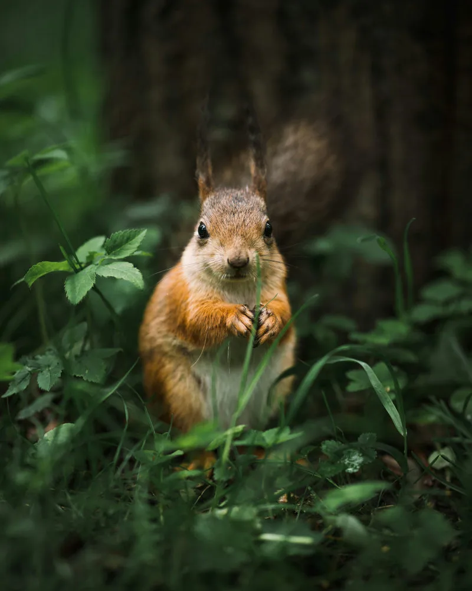

## Why interactive visualizations?

::: {.fragment}

- Explore through zooming, filtering, brushing, hover details, and controls.
- Keep the first view focused while making record-level detail available on demand.
- Choose interaction to answer a question, not as decoration.

:::

::: {.fragment}

**Design principles**

- Shape and summarize data before it reaches the browser.
- Make every interaction earn its place.
- Preserve a static fallback for reports and accessibility.
- Aggregate, filter, or use transparency when many marks overlap.

:::

## Squirrels data

::: {.columns}
::: {.column width="60%"}

- The [NYC Squirrel Census from TidyTuesday](https://github.com/rfordatascience/tidytuesday/tree/main/data/2019/2019-10-29) is used as example data
- It includes categories, dates, logical behaviours, identifiers, and coordinates

:::
::: {.column width="40%"}



:::
:::

::: {.aside}
[Squirrel Analysis](https://ainsleyowens.github.io/BioStatisticsAnalysis/SquirrelAnalysis.html)  
[Image credits: Unsplash Andrey Svistunov]{.smaller}
:::

## Data preparation

```{r}
#| label: setup
#| echo: false
#| eval: true
library(dplyr)
library(tidyr)
library(readr)
library(ggplot2)
library(ggiraph)
library(plotly)
library(highcharter)
library(DT)

library(reactable)
library(gt)
```

```{r}
#| label: load-squirrels
#| cache: true
#| eval: true
squirrels <- read_csv(
  "https://raw.githubusercontent.com/rfordatascience/tidytuesday/master/data/2019/2019-10-29/nyc_squirrels.csv",
  show_col_types = FALSE
)
```

```{r}
#| label: prepare-squirrels
#| eval: true
squirrels <- squirrels |>
  mutate(
    observation_date = as.Date(as.character(date), format = "%m%d%Y"),
    fur_color = factor(
      coalesce(primary_fur_color, "Unknown"),
      levels = c("Gray", "Cinnamon", "Black", "Unknown")
    ),
    age_group = case_when(
      age %in% c("Adult", "Juvenile") ~ age,
      TRUE ~ "Unknown"
    ),
    above_ground_sighter_measurement = as.integer(
      if_else(above_ground_sighter_measurement == "FALSE", "0", above_ground_sighter_measurement)
    ),
    location = coalesce(location, "Unknown"),
    shift = factor(shift, levels = c("AM", "PM"))
  )

fur_colors <- c(
  Gray = "#7A7D80",
  Cinnamon = "#B65A24",
  Black = "#2B2B2B",
  Unknown = "#BDBDBD"
)

squirrel_points <- squirrels |>
  filter(!is.na(long), !is.na(lat)) |>
  mutate(
    point_id = row_number(),
    hover = paste0(
      "<b>", unique_squirrel_id, "</b><br>",
      "Fur: ", fur_color, "<br>",
      "Age: ", age_group, "<br>",
      "Shift: ", shift, "<br>",
      "Location: ", location
    )
  )

fur_counts <- squirrels |>
  count(fur_color, sort = TRUE)

squirrel_preview <- squirrels |>
  select(unique_squirrel_id, shift, age_group, fur_color, location, long, lat) |>
  slice_head(n = 15)

behaviour_names <- c(
  "running", "chasing", "climbing", "eating", "foraging", "kuks",
  "quaas", "moans", "tail_flags", "tail_twitches", "approaches",
  "indifferent", "runs_from"
)
```

## R interactive ecosystem

::: {.large .incremental}

- **Tables:** `DT`, `reactable`, `gt`
- **Charts:** `plotly`, `highcharter`, `dygraphs`, `ggiraph`, `echarts4r`
- **Maps:** `leaflet`, `mapgl`, `mapview`, `mapdeck`, `tmap`
- **Networks:** `visNetwork`, `networkD3`, `DiagrammeR`
- **Linked data:** `crosstalk`

:::

## Tables: `DT`

:::: {.columns}
::: {.column width="40%"}

```r
library(DT)
datatable(
  squirrel_preview,
  filter = "top",
  options = list(
    pageLength = 5, 
    scrollX = TRUE
  ),
  rownames = FALSE
)
```

`DT` wraps DataTables.js with filtering, sorting, pagination, and export extensions.

:::
::: {.column width="60%"}

```{r}
#| label: dt-squirrel-output
#| echo: false
#| eval: true
datatable(
  squirrel_preview,
  filter = "top",
  options = list(pageLength = 5, scrollX = TRUE),
  rownames = FALSE
)
```

:::
::::

## Tables: `reactable`

:::: {.columns}
::: {.column width="40%"}

```r
library(reactable)
reactable(
  squirrel_preview,
  filterable = TRUE,
  searchable = TRUE,
  striped = TRUE,
  highlight = TRUE,
  defaultPageSize = 3
)
```

`reactable` provides React-based tables with strong R-side formatting options.

:::
::: {.column width="60%"}

```{r}
#| label: reactable-squirrel-output
#| echo: false
#| eval: true
reactable(
  squirrel_preview,
  filterable = TRUE,
  searchable = TRUE,
  striped = TRUE,
  highlight = TRUE,
  defaultPageSize = 3
)
```

:::
::::

## Tables: `gt`

:::: {.columns}
::: {.column width="50%"}

```r
library(gt)
squirrel_preview |>
  select(
    unique_squirrel_id, 
    shift, 
    age_group, 
    fur_color, 
    location) |>
  gt() |>
  cols_label(
    unique_squirrel_id = "Squirrel ID",
    age_group = "Age",
    fur_color = "Fur color"
  ) |>
  opt_interactive()
```

`gt` is primarily for publication-ready tables, with a concise interactive mode.

:::
::: {.column width="50%"}

```{r}
#| label: gt-squirrel-output
#| echo: false
#| eval: true
squirrel_preview |>
  select(unique_squirrel_id, shift, age_group, fur_color, location) |>
  gt() |>
  cols_label(
    unique_squirrel_id = "Squirrel ID",
    age_group = "Age",
    fur_color = "Fur color"
  ) |>
  opt_interactive()
```

:::
::::

## ggiraph

`ggiraph` adds browser interactions to familiar `ggplot2` geoms.

:::: {.columns}
::: {.column width="60%"}

```r
library(ggiraph)

ggiraph_plot <- ggplot(
  squirrel_points,
  aes(long, lat, color = fur_color)
) +
  geom_point_interactive(
    aes(tooltip = hover),
    alpha = 0.65,
    size = 1.8
  ) +
  scale_color_manual(values = fur_colors) +
  labs(x = "Longitude", y = "Latitude", color = "Fur color") +
  theme_minimal()

girafe(ggobj = ggiraph_plot)
```

:::
::: {.column width="40%"}

```{r}
#| label: ggiraph-point-output
#| echo: false
#| eval: true
ggiraph_plot <- ggplot(
  squirrel_points,
  aes(long, lat, color = fur_color)
) +
  geom_point_interactive(
    aes(tooltip = hover),
    alpha = 0.65,
    size = 1.8
  ) +
  scale_color_manual(values = fur_colors) +
  labs(x = "Longitude", y = "Latitude", color = "Fur color") +
  theme_minimal()

girafe(
  ggobj = ggiraph_plot,
  width_svg = 5,
  height_svg = 4
)
```

:::
::::

## Plotly

- R interface to Plotly.js
- `plot_ly()` builds native traces and layouts
- Strong for custom hover content, subplot composition, linked selection, and maps
- `ggplotly()` provides a quick bridge from `ggplot2`

::: {.aside}

[Plotly R reference](https://plotly.com/r/)

:::

## Plotly: bar traces and hover text

:::: {.columns}
::: {.column width="60%"}

```r
plot_ly(
  fur_counts,
  x = ~fur_color, 
  y = ~n,
  type = "bar", 
  text = ~paste0(fur_color, ": ", n),
  hoverinfo = "text",
  marker = list(
    color = unname(fur_colors[as.character(fur_counts$fur_color)])
  ),
  width = 360, 
  height = 430
) |>
  layout(
    title = "Primary fur color counts",
    xaxis = list(title = "Fur color"),
    yaxis = list(title = "Observations")
  )
```

:::
::: {.column width="40%"}

```{r}
#| label: plotly-bar-output
#| echo: false
#| eval: true
plot_ly(
  fur_counts,
  x = ~fur_color, y = ~n,
  type = "bar", 
  text = ~paste0(fur_color, ": ", n),
  hoverinfo = "text",
  marker = list(
    color = unname(fur_colors[as.character(fur_counts$fur_color)])
  ),
  width = 360, 
  height = 430
) |>
  layout(
    title = "Primary fur color counts",
    xaxis = list(title = "Fur color"),
    yaxis = list(title = "Observations")
  )
```

:::
::::

## Plotly: grouped and stacked bars

:::: {.columns}
::: {.column width="60%"}

```r
location_age <- squirrels |>
  filter(
    age_group != "Unknown", 
    location != "Unknown"
  ) |>
  count(location, age_group)

plot_ly(
  location_age,
  x = ~location, 
  y = ~n,
  color = ~age_group, 
  type = "bar"
) |>
  layout(
    title = "Location by age group",
    barmode = "group"
  )
```

Use `barmode = "stack"` for composition and `"group"` for direct comparison.

:::
::: {.column width="40%"}

```{r}
#| label: plotly-grouped-bar-output
#| echo: false
#| eval: true
location_age <- squirrels |>
  filter(
    age_group != "Unknown", 
    location != "Unknown"
  ) |>
  count(location, age_group)

plot_ly(location_age, x = ~location, y = ~n,
  color = ~age_group, type = "bar", width = 360, height = 430) |>
  layout(
    title = "Location by age group", 
    barmode = "group",
    yaxis = list(title = "Observations")
  )
```

:::
::::

## Plotly: date axes and range sliders

:::: {.columns}
::: {.column width="60%"}

```r
daily_counts <- squirrels |>
  count(observation_date, shift) |>
  filter(
    !is.na(observation_date), 
    !is.na(shift)
  )

plot_ly(daily_counts,
  x = ~observation_date,
  y = ~n,
  color = ~shift
) |>
  add_lines() |>
  add_markers() |>
  layout(xaxis = list(
    rangeslider = list(visible = TRUE)
  ))
```

A range slider exposes a detailed time window without rebuilding the chart.

:::
::: {.column width="40%"}

```{r}
#| label: plotly-time-series-output
#| echo: false
#| eval: true
daily_counts <- squirrels |>
  count(observation_date, shift) |>
  filter(!is.na(observation_date), !is.na(shift))

plot_ly(daily_counts, x = ~observation_date, y = ~n, color = ~shift,
  width = 500, height = 430) |>
  add_lines() |>
  add_markers() |>
  layout(
    title = "Daily observations by census shift",
    xaxis = list(title = "Date", rangeslider = list(visible = TRUE)),
    yaxis = list(title = "Observations")
  )
```

:::
::::

## Plotly: heatmaps

:::: {.columns}
::: {.column width="60%"}

```r
behaviour_by_shift <- squirrels |>
  select(shift, all_of(behaviour_names)) |>
  filter(!is.na(shift)) |>
  pivot_longer(
    -shift, 
    names_to = "behaviour", 
    values_to = "observed"
  ) |>
  group_by(shift, behaviour) |>
  summarise(
    proportion = mean(observed), 
    .groups = "drop"
  ) |>
  pivot_wider(
    names_from = shift, 
    values_from = proportion
  )

plot_ly(
  x = c("AM", "PM"), 
  y = behaviour_by_shift$behaviour,
  z = as.matrix(select(behaviour_by_shift, AM, PM)),
  type = "heatmap", 
  colors = "YlGnBu"
)
```

:::
::: {.column width="40%"}

```{r}
#| label: plotly-heatmap-output
#| echo: false
#| eval: true
behaviour_by_shift <- squirrels |>
  select(shift, all_of(behaviour_names)) |>
  filter(!is.na(shift)) |>
  pivot_longer(-shift, names_to = "behaviour", values_to = "observed") |>
  group_by(shift, behaviour) |>
  summarise(proportion = mean(observed), .groups = "drop") |>
  pivot_wider(names_from = shift, values_from = proportion)

plot_ly(
  x = c("AM", "PM"), y = behaviour_by_shift$behaviour,
  z = as.matrix(select(behaviour_by_shift, AM, PM)),
  type = "heatmap", colors = "YlGnBu",
  hovertemplate = "%{y}, %{x}: %{z:.1%}<extra></extra>",
  width = 360, height = 430
) |>
  layout(title = "Observed behaviours by shift")
```

:::
::::

## Plotly: maps and hover templates

:::: {.columns}
::: {.column width="55%"}

```r
plot_ly(
  squirrel_points,
  type = "scattermapbox",
  lon = ~long, lat = ~lat,
  color = ~fur_color,
  colors = unname(fur_colors),
  text = ~hover, hoverinfo = "text",
  marker = list(size = 7, opacity = 0.65)
) |>
  layout(mapbox = list(
    style = "open-street-map",
    center = list(
      lon = -73.9654, 
      lat = 40.7829
    ), 
    zoom = 12.5
  ))
```

:::
::: {.column width="45%"}

```{r}
#| label: plotly-map-output
#| echo: false
#| eval: true
plot_ly(
  squirrel_points, type = "scattermapbox",
  lon = ~long, lat = ~lat, color = ~fur_color,
  colors = unname(fur_colors),
  text = ~hover, hoverinfo = "text",
  marker = list(size = 7, opacity = 0.65), width = 800, height = 500
) |>
  layout(
    title = "Squirrel observation locations",
    mapbox = list(
      style = "open-street-map",
      center = list(lon = -73.9654, lat = 40.7829), zoom = 12.5
    ),
    margin = list(l = 0, r = 0, b = 0, t = 40)
  )
```

:::
::::

## {background-image="assets/jan-nyc.webp"}

## Plotly: linked selections

:::: {.columns}
::: {.column width="50%"}

```r
linked_points <- squirrel_points |>
  mutate(point_id = row_number()) |>
  highlight_key(~point_id)

coordinates <- plot_ly(linked_points,
  x = ~long, y = ~lat, color = ~fur_color,
  type = "scatter", mode = "markers",
  colors = unname(fur_colors)
)
height <- plot_ly(linked_points,
  x = ~hectare_squirrel_number,
  y = ~above_ground_sighter_measurement,
  color = ~fur_color, type = "scatter", 
  mode = "markers",
  showlegend = FALSE,
  colors = unname(fur_colors)
)

highlight(subplot(coordinates, height),
  on = "plotly_selected", dynamic = TRUE)
```

:::
::: {.column width="50%"}

```{r}
#| label: plotly-linked-output
#| echo: false
#| eval: true
linked_points <- squirrel_points |>
  mutate(point_id = row_number()) |>
  highlight_key(~point_id)

coordinates <- plot_ly(linked_points, x = ~long, y = ~lat,
  color = ~fur_color, type = "scatter", mode = "markers",
  colors = unname(fur_colors),
  width = 600, height = 430)
height <- plot_ly(linked_points, x = ~hectare_squirrel_number,
  y = ~above_ground_sighter_measurement, color = ~fur_color,
  type = "scatter", mode = "markers", showlegend = FALSE,
  colors = unname(fur_colors),
  width = 550, height = 430)

highlight(subplot(coordinates, height),
  on = "plotly_selected", dynamic = TRUE) |>
  layout(
    dragmode = "select",
    xaxis = list(title = "Longitude"),
    yaxis = list(title = "Latitude"),
    xaxis2 = list(title = "Hectare squirrel number"),
    yaxis2 = list(title = "Above-ground sighting measurement")
  )
```

:::
::::

## The ggplot2 bridge

:::: {.columns}
::: {.column width="60%"}

```r
static_plot <- ggplot(
  squirrel_points,
  aes(long, lat, color = fur_color)
) +
  geom_point(alpha = 0.6) +
  labs(
    x = "Longitude", 
    y = "Latitude", 
    color = "Fur color"
  ) +
  scale_color_manual(values = fur_colors) +
  theme_minimal()

ggplotly(static_plot)
```

Use `ggplotly()` for quick hover and zoom. Use native Plotly traces when interaction needs precise control.

:::
::: {.column width="40%"}

```{r}
#| label: ggplotly-scatter-output
#| echo: false
#| eval: true
static_plot <- ggplot(
  squirrel_points,
  aes(long, lat, color = fur_color)
) +
  geom_point(alpha = 0.6) +
  labs(x = "Longitude", y = "Latitude", color = "Fur color") +
  scale_color_manual(values = fur_colors) +
  theme_minimal()

ggplotly(static_plot, width = 500, height = 500)
```

:::
::::

## Highcharter

- R wrapper around the Highcharts JavaScript ecosystem
- `hchart()` is concise for familiar data shapes
- `highchart()` plus `hc_add_series()` gives explicit series control
- Exporting, themes, and configuration are first-class features

::: {.aside}

[Highcharter reference](https://jkunst.com/highcharter/reference/index.html)

:::

## Highcharter: quick charts with `hchart()`

:::: {.columns}
::: {.column width="50%"}

```r
fur_counts |>
  hchart("column", 
    hcaes(
      x = fur_color, 
      y = n
    )
  ) |>
  hc_title(
    text = "Primary fur color counts"
  ) |>
  hc_yAxis(
    title = list(text = "Observations")
  ) |>
  hc_plotOptions(
    column = list(
      dataLabels = list(enabled = TRUE)
    )
  )
```

`hchart()` turns a data frame and mapped columns into a chart quickly.

:::
::: {.column width="50%"}

```{r}
#| label: highcharter-column-output
#| echo: false
#| eval: true
fur_counts |>
  hchart("column", hcaes(x = fur_color, y = n)) |>
  hc_title(text = "Primary fur color counts") |>
  hc_yAxis(title = list(text = "Observations")) |>
  hc_plotOptions(column = list(colorByPoint = TRUE, dataLabels = list(enabled = TRUE))) |>
  hc_colors(unname(fur_colors[as.character(fur_counts$fur_color)])) |>
  hc_size(width = 500, height = 500)
```

:::
::::

## Highcharter: stacking, tooltips, and exporting

:::: {.columns}
::: {.column width="50%"}

```r
daily_counts |>
  mutate(
    timestamp = datetime_to_timestamp(observation_date)
  ) |>
  hchart("area", 
    hcaes(
      x = timestamp, 
      y = n, 
      group = shift)
  ) |>
  hc_xAxis(type = "datetime") |>
  hc_plotOptions(
    area = list(stacking = "normal")
  ) |>
  hc_tooltip(shared = TRUE) |>
  hc_exporting(enabled = TRUE)
```

These options layer chart behaviour independently from the series definition.

:::
::: {.column width="50%"}

```{r}
#| label: highcharter-area-output
#| echo: false
#| eval: true
daily_counts |>
  mutate(timestamp = datetime_to_timestamp(observation_date)) |>
  hchart("area", hcaes(x = timestamp, y = n, group = shift)) |>
  hc_title(text = "Daily observations by census shift") |>
  hc_xAxis(type = "datetime") |>
  hc_plotOptions(area = list(stacking = "normal")) |>
  hc_tooltip(shared = TRUE) |>
  hc_exporting(enabled = TRUE) |>
  hc_size(width = 500, height = 500)
```

:::
::::

## Highcharter: coordinate scatterplots

:::: {.columns}
::: {.column width="50%"}

```r
highchart() |>
  hc_add_series(
    squirrel_points,
    type = "scatter",
    hcaes(
      x = long,
      y = lat,
      name = unique_squirrel_id, 
      group = fur_color
    ),
    marker = list(radius = 4)
  ) |>
  hc_xAxis(title = list(text = "Longitude")) |>
  hc_yAxis(title = list(text = "Latitude")) |>
  hc_mapNavigation(
    enabled = TRUE
  )
```

A coordinate scatterplot is a lightweight geographic fallback when a basemap is unnecessary.

:::
::: {.column width="50%"}

```{r}
#| label: highcharter-map-output
#| echo: false
#| eval: true
highchart() |>
  hc_add_series(
    squirrel_points, type = "scatter",
    hcaes(x = long, y = lat, name = unique_squirrel_id,
      group = fur_color),
    marker = list(radius = 4)
  ) |>
  hc_title(text = "Squirrel observations") |>
  hc_xAxis(title = list(text = "Longitude")) |>
  hc_yAxis(title = list(text = "Latitude")) |>
  hc_colors(unname(fur_colors)) |>
  hc_size(width = 500, height = 500)
```

:::
::::

## Summary

::: {.incremental}

- `plot_ly()` builds traces; `layout()` controls presentation; `highlight()` links views
- `hchart()` is concise; `highchart()` plus `hc_add_series()` is explicit and extensible
- Both support hover, zoom, and export
- Plotly has a `ggplot2` bridge
- Highcharts is not free for commercial use

:::

## Resources

- [Plotly R documentation](https://plotly.com/r/)
- [Highcharter documentation](https://jkunst.com/highcharter/)
- [TidyTuesday NYC Squirrel data](https://github.com/rfordatascience/tidytuesday/tree/master/data/2019/2019-10-29)

##  {background-image="/assets/images/network.svg"}

::: {.v-center .center}
::: {}

[Thank you!]{.largest}

[Questions?]{.larger}

[ • [SciLifeLab](https://www.scilifelab.se/) • [NBIS](https://nbis.se/) • [RaukR](https://nbisweden.github.io/raukr-2026)]{.smaller}

:::
:::

## Session

```{r}
#| label: session-info
#| echo: false
#| eval: true
sessionInfo()
```
