## Packages {visibility="hidden"}

```{r}
#| echo: false

library(MASS)
library(ISLR2)
library(glmnet)
library(ggplot2)
library(patchwork)
```

## R and statistics

- S (for **S**tatistics) is a statistical programming language developed at Bell Labs in 1976. 
  - *"to turn ideas into software, quickly and faithfully"* -- John Chambers

- Bell labs: Unix, C, C++, Information Theory
  - 11 Nobel prizes and 5 Turing awards

. . . 

- R released in 1993 by **R**oss Ihaka and **R**obert Gentleman as the free and open-source alternative (part of GNU project) using ideas and syntax from S.
  - R 1.0 released in 2000.
  
. . . 

- R is the language of choice for academic statisticians and new developments and methods in statistics are often released as R package first.


## R and statistics

:::: {.columns}

::: {.column width="70%"}

:::

::::

::: {.aside}
[Rousseeuw Prize](https://www.rousseeuwprize.org/2026)
:::


::: {.notes}

S: statisticians needed a flexible framework to explore data and where they could also develop new methods

Bell Labs:
 - an American industrial research and development company owned by the Finnish technology company Nokia.
 - former subsidiary of the American Telephone and Telegraph Company (AT&T)

R: first letters in creators' names and the S language successor

Robert Gentleman (23andme) + others - Bioconductor project in 2001

- The Rousseeuw Prize for Statistics: awarded every 2 years, US$1,000,000 award, Belgium
 
:::


## Statistical methods are developed to make sense of the world

:::: {.columns}

::: {.column width="70%"}
- William Sealy Gosset worked as a chemist and brewer at Guinness Brewery in Dublin in the early 1900s.
- Used pen name *Student* because Guinness prohibited employees from publishing research under their own names.
- Guiness wanted to improve barley varieties and beer quality.
- Experiments with small sample sizes. The population variance is unknown and must be estimated.
- Student's t-distribution and test of statistical significance.

:::

::: {.column width="20%"}
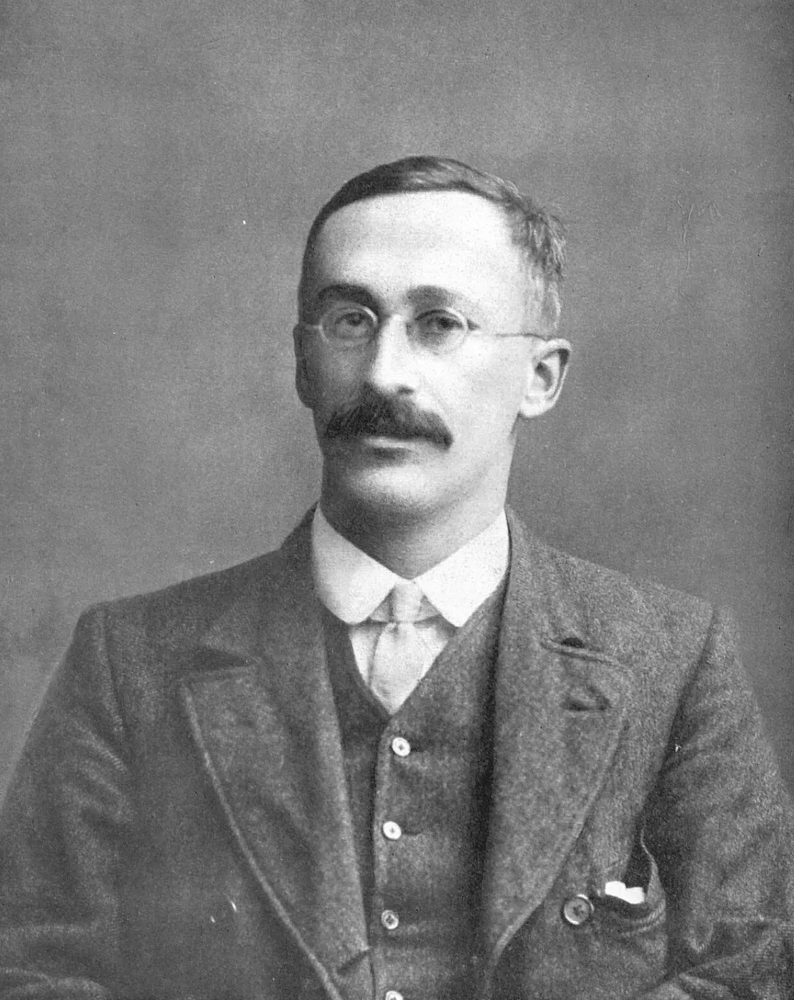
:::


::::

::: {.notes}
Gosset's idea was simply to replace σ (population) with s (sample). Because s is itself random.
Sometimes it underestimates the true variability. Sometimes it overestimates it. That makes the standardized statistic more variable than a Normal random variable, producing the heavier tails of the t-distribution. As the sample size increases, s→σ, so the t-distribution approaches the Normal distribution.
:::

## Data science and learning from data

:::: {.columns}

::: {.column width="60%"}

- Eratosthenes: ancient Greek philosopher, scholar, mathematician, geographer, poet, astronomer and music theorist.
- Estimating the circumference of the earth in 240 BC.
- Assumptions:
  - earth is round
  - sun is so far the rays coming from there are parallel
  - distance between Alexandria and Syene is known
  
|

- $\frac{7.2^\circ}{360^\circ}=\frac{ditance \ between \ Alexandria \ and \ Aswan}{Earth's \ circumference}$

|

- His estimate: approximately 40,338 km (25,065 mi)
- Today's number (around the equator): 40,075.017 km (24,901.461 mi) 
  
:::
 
::: {.column width="40%"}

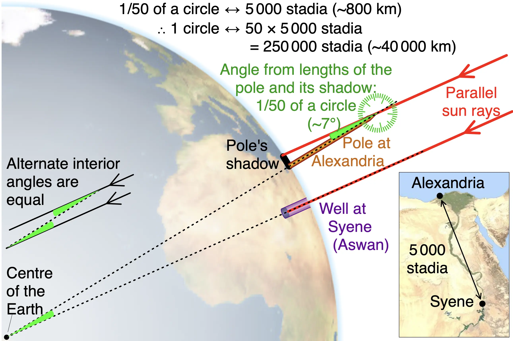  
:::
 
  
::::
  
::: {.aside}
https://en.wikipedia.org/wiki/Eratosthenes
:::


## Data science today

:::: {.columns}

::: {.column width="30%"}
{width=80%}
:::

::: {.column width="30%"}
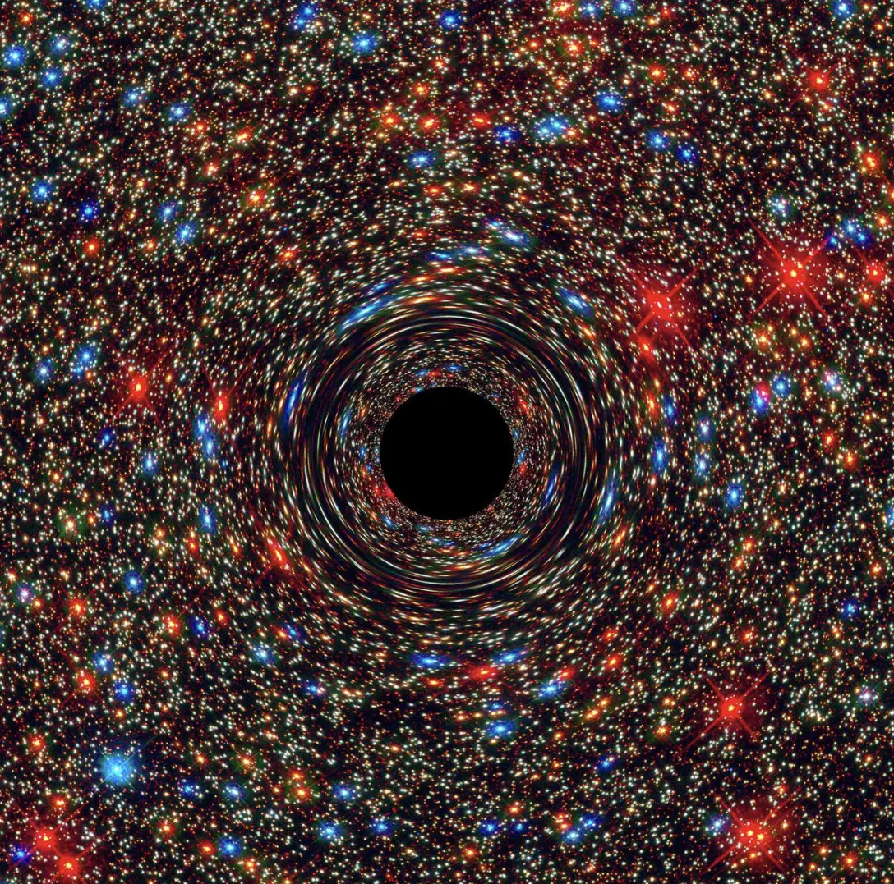{width=80%}
:::

::: {.column width="30%"}
{width=80%}
:::

::::

::: {.small}
- Nowadays, skill set: 
  - programming
  - statistics
  - data visualization
  - creativity
  - data exploration and going hunting for "problems"
  - understanding the data and data generation process
  - formulating a question and then finding the right method to answer it
  - communication in an interdisciplinary world
  
:::

::: {.aside}
https://images.nasa.gov
:::

## Statistical learning

:::: {.columns}

::: {.column width="70%"}

- "Statistical learning refers to a set of tools for making sense of complex datasets" -- An Introduction to Statistical Learning by James, Witten, Hastie and Tibshirani

- Many of these methods were developed long before we had computers, and they are incredibly useful today.

- No single methods will perform well or be appropriate for all data set. It is therefore important to understand how these tools work, when to use them and how to interpret the results.

- "*We are drowning in information and starving for knowledge*" -- Rutherford D. Roger as quoted in Elements of Statistical Learning

:::

::: {.column width="30%"}

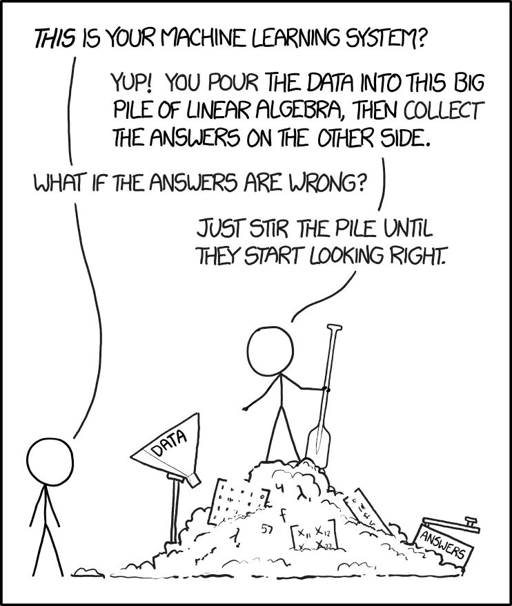
:::

::::

::: {.aside}
(https://xkcd.com/1838)
:::

::: {.notes}
- "Statistical learning should not be viewed as a series of black boxes. No single approach will perform well in all possible applications. Without understanding all of the cogs inside the box, or the interaction between those cogs, it is impossible to select the best box." -- An Introduction to Statistical Learning by James, Witten, Hastie and Tibshirani
:::


## Supervised vs unsupervised learning

:::: {.columns}

::: {.column width="50%"}

::: {.fragment}
- Suppose we have measurements for $p$ variables $x_1, x_2 ... x_p$ and their associated response measurement $y$ and wish to say something about how $x_1, x_2 ... x_p$ explain or relate to $y$. An example is prediction or classification.

- $y \sim f(x)$

{width=35%}

:::

::: 

::: {.column width="50%"}

::: {.fragment}
- Suppose we only have measurements for variables $x_1, x_2 ... x_p$ and wish to learn the relationships between them. An example method is clustering.

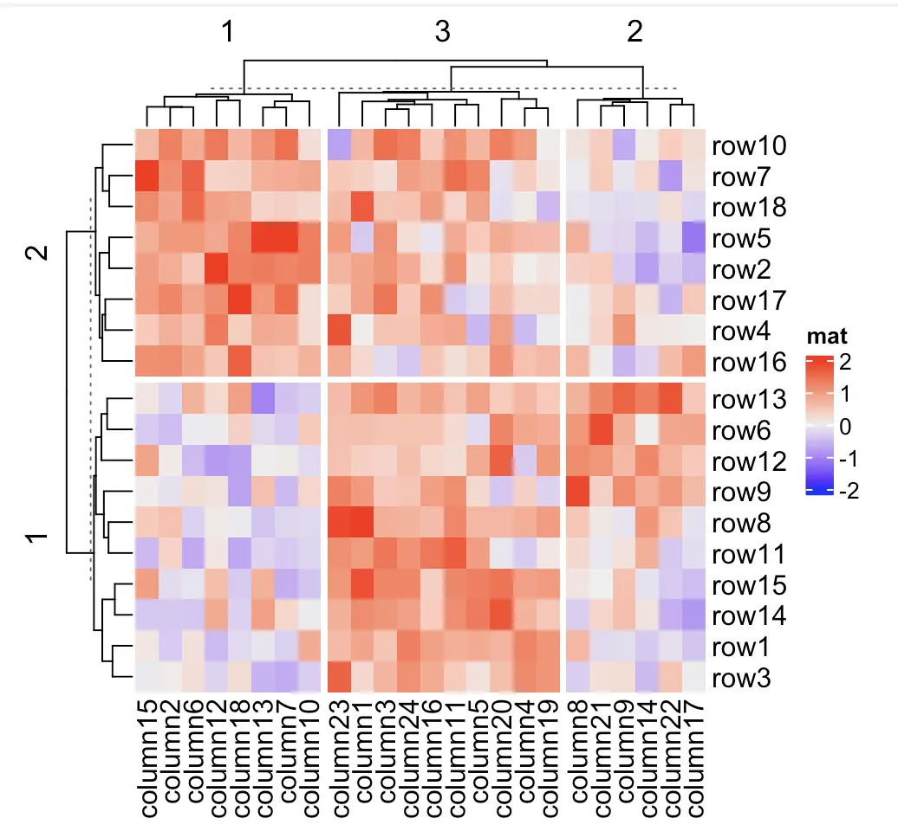{width=70%}
:::

:::

::::

::: {.aside}
- [https://xkcd.com/2173/](https://xkcd.com/2173/)
- Complex Heatmap book
:::


## Linear models

| 
|

[$y = f(x) + \epsilon$]{.large}

- $y$ is often called the response or dependent variable

- $x$ is often called the predictor or independent variable

- $\epsilon$ is the random error term

- Statistical learning refers to a set of approaches for estimating $f$ 

- Simple linear model: $y = \beta_0 + \beta_1x + \epsilon$

- By the 1970s many methods for learning from the data were available. The vast majority of them were *linear* methods because fitting *non-linear* relationships was computationally difficult at the time.


::: {.notes}
Neural networks gained popularity in the 1980s, and support vector machines arose in the 1990s.
::: 


## Prediction

- Training data vs test data

- Trade off between prediction accuracy and model interpretability

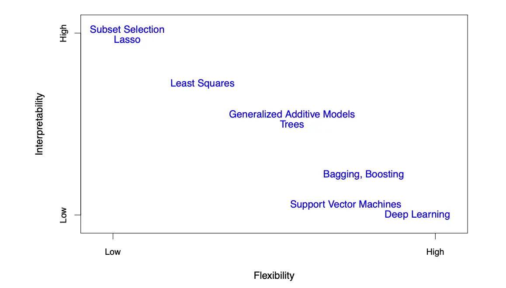{width=60%}

::: {.aside}
Image from An Introduction to Statistical Learning
:::


## Inference

- Which predictors ($x$s) are associated with the response $y$?
- Can we learn something about this relationship?
- Suppose we saw the data below, can we use a model to learn the nature of the relationship?

:::: {.columns}

::: {.column width="50%"}

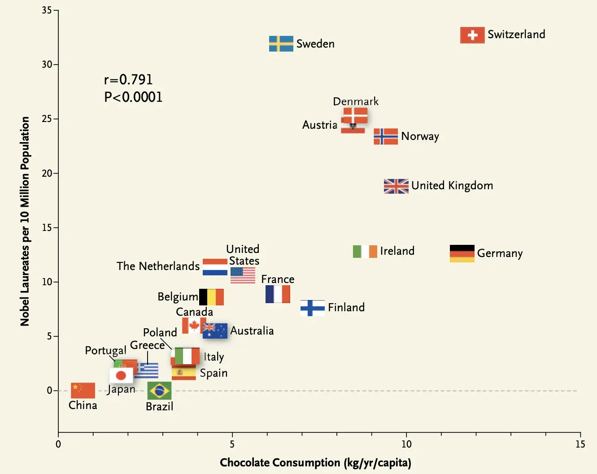{width=90%}

:::

::: {.column width="50%"}

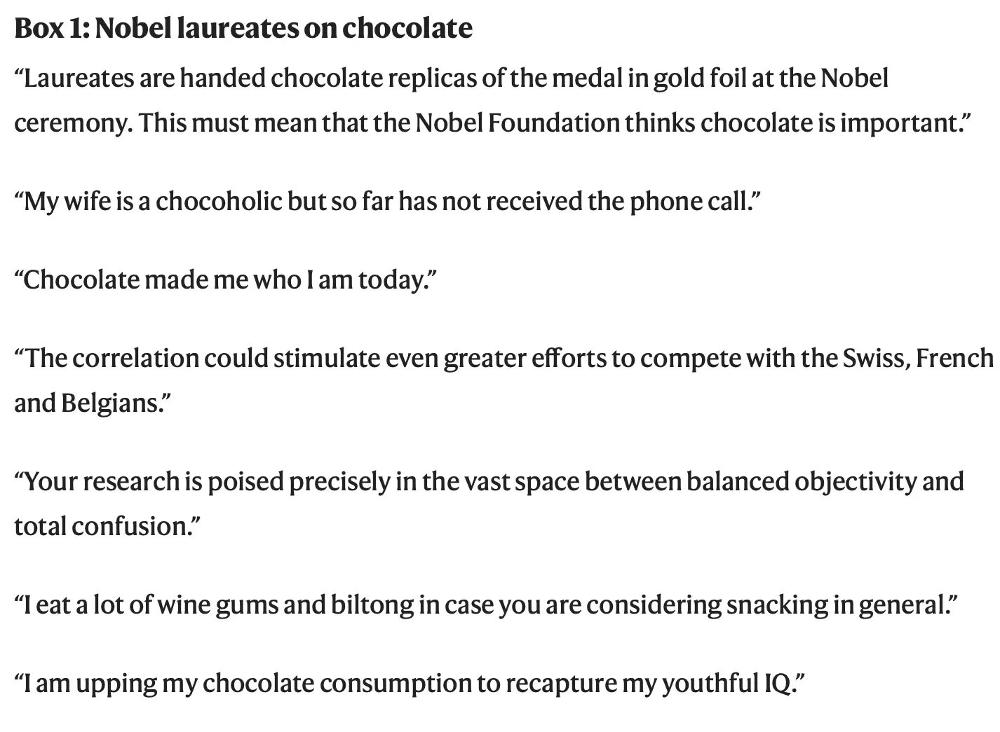{width=90%}

:::

::::


::: {.aside}
[Franz H. Messerli 2012](https://library.scottbarrykaufman.com/uploads/2012/10/Messerli-2012.pdf)
[Chocolate habits of Nobel prizewinners](https://www.nature.com/articles/499409a)
:::


## Why care about linear approaches?

:::: {.columns}

::: {.column width="30%"}

- Having a good understanding of linear models is essential for understanding non-linear ones. Many of the latter are generalizations of the linear methods.

- Powerful in their interpretability and in their flexibility

- If we are interested in *inference* then retaining interpretability is key

:::

::: {.column width="70%"}

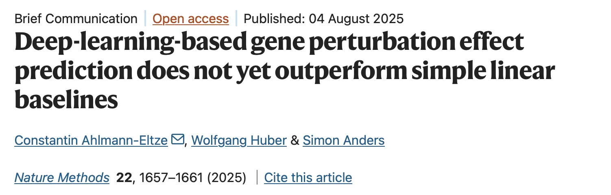

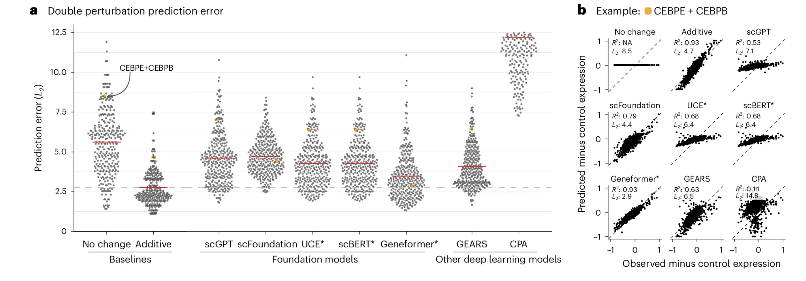

:::

::::

## Simple Linear regression

- learn the association between a single predictor $x$ and a quantitative response $y$.

- assumes an approximately linear relationship between $x$ and $y$.

$$y = \beta_0 + \beta_1x + \epsilon$$

- The error term $\epsilon$ captures the noise or lack of fit to the linear equation.

```{r}
#| fig-height: 4
#| fig-width: 5
#| echo: false

advertisingData <- read.csv(file = "https://www.statlearning.com/s/Advertising.csv", 
                            header = TRUE, 
                            row.names = 1)

ggplot(advertisingData, aes(x = TV, y = sales)) + 
    geom_point() + 
    geom_smooth(method = "lm", se = FALSE) + 
    theme_bw()
```

## Least squares


:::: {.columns}

::: {.column width="40%"}

::: {.fragment}
- $y = \beta_0 + \beta_1x + \epsilon$
:::


::: {.fragment}
- $\hat{y_i}=\beta_0 + \beta_1x_i$
:::

::: {.fragment}
- $e_i=y_i-\hat{y_i}$
::: 

::: {.fragment}
- The residual sum of squares (RSS) is defined as $RSS=\sum_{i=1}^Ne_i^2$

- We want to choose beta estimates which minimize the RSS. This is the least squares method.

- Least squares was developed at the beginning of the 19th century (earliest form of linear regression), with applications in astronomy.
:::

:::

::: {.column width="60%"}

::: {.fragment}
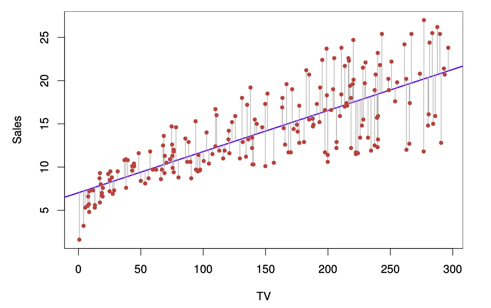
::: 

::: 


::::

::: {.aside}
Image from An Introduction to Statistical Learning
:::

::: {.notes}
What do the beta terms reflect> intercept: expected y when x=0, slope: avr increase in y associated with one unit increase in x.
:::

## Multiple linear regression

:::: {.columns}

::: {.column width="60%"}
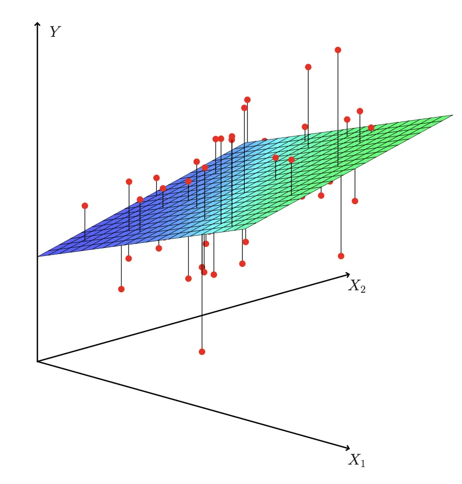{width=70%}
:::

::: {.column width="40%"}
- $y = \beta_0 + \beta_1x_1 + \beta_2x_2 + ... + \beta_px_p + \epsilon$
- $y = \beta.X + \epsilon$
- Assumptions:
  - linear relationship
  - constant variance of residuals (homoscedasticity)
  - $\epsilon \sim N(0, \sigma^2)$
  - independence of observations
  - no multicollinearity among predictors
  - n >> p
  
::: {.fragment}
- Is this a linear model? $log2(y) = \beta_0 + \beta_1x_1 + \beta_2x_2^2 + \beta_3\sqrt{x_3} + \epsilon$
:::

:::

::::

::: {.aside}
Image from An Introduction to Statistical Learning
:::

## Multiple linear regression

:::: {.columns}

::: {.column width="50%"}
::: {.small}
```{r}
## predictor matrix
X <- model.matrix(~ TV + radio + newspaper, 
                  data = advertisingData)
head(X)
```
:::
::: 

::: {.column width="50%"}
::: {.small}
```{r}
## linear fit
fit <- lm(sales ~ X + 0, data = advertisingData)
summary(fit)
```
::: 
:::

::::

## Categorical variables and interaction terms

:::: {.columns}

::: {.column width="50%"}

- Categorical variables with $l$ levels can be represented as $l-1$ so called dummy variables consisting of columns of 1s and 0s. We will see this more in the lab session.
- Beta coefficients per predictor say something about the effect of that predictor on $y$ when all others are fixed.
- Interaction terms allow us to capture more complex relationships in the model reflecting the joint effect of two predictors. This is represented in the product of the two predictors.

::: 

::: {.column width="50%"}
::: {.small}
```{r}
X <- model.matrix(~ TV + radio + newspaper + TV:radio, 
                  data = advertisingData)
head(X)
```

| 
|

```{r}
X <- model.matrix(~ TV*radio + newspaper, 
                  data = advertisingData)
head(X)
```
:::
:::

:::: 

## Evaluating the quality of the linear fit

:::: {.columns}

::: {.column width="50%"}
- Residual standard error $RSE=\sqrt{\frac{1}{N-p-1}RSS}$
- Roughly represents the average amount of deviation from the fitted line.
- The size of the RSE value will reflect how poorly the model fits the data.
- Measured in units of $y$.

::: {.fragment}
- $R^2=\frac{TSS-RSS}{TSS}$ where $TSS=\sum(y_i-\bar{y})^2$.
- RSS can be thought of as measuring the variability that is left unexplained after doing the regression.
- The $R^2$ value thus reflects the proportion of variability in $y$ that can be explained using $x$ by performing the regression.
:::

:::

::: {.column width="50%"}
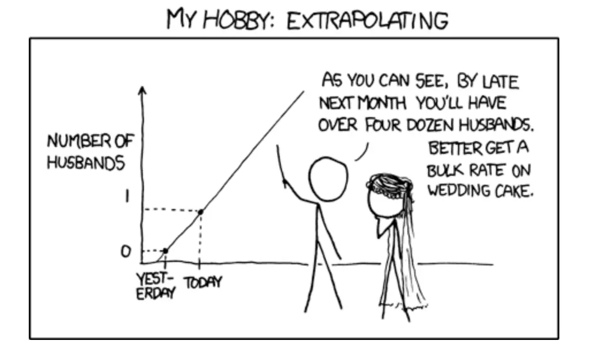
:::

::::

::: {.aside}
[https://xkcd.com/605/](https://xkcd.com/605/)
:::

## Correlation is not causation

:::: {.columns}

::: {.column width="50%"}

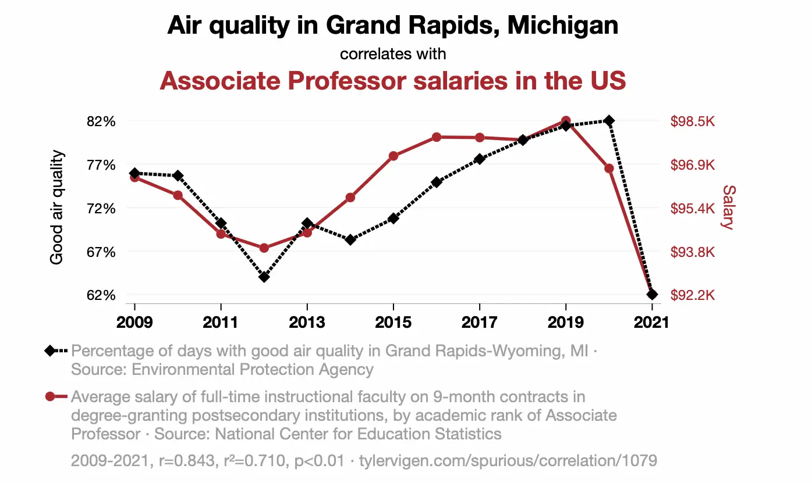{width=70%}
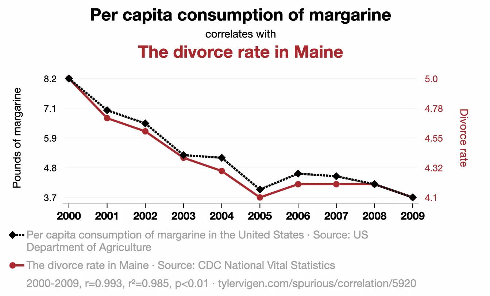{width=70%}

:::

::: {.column width="50%"}

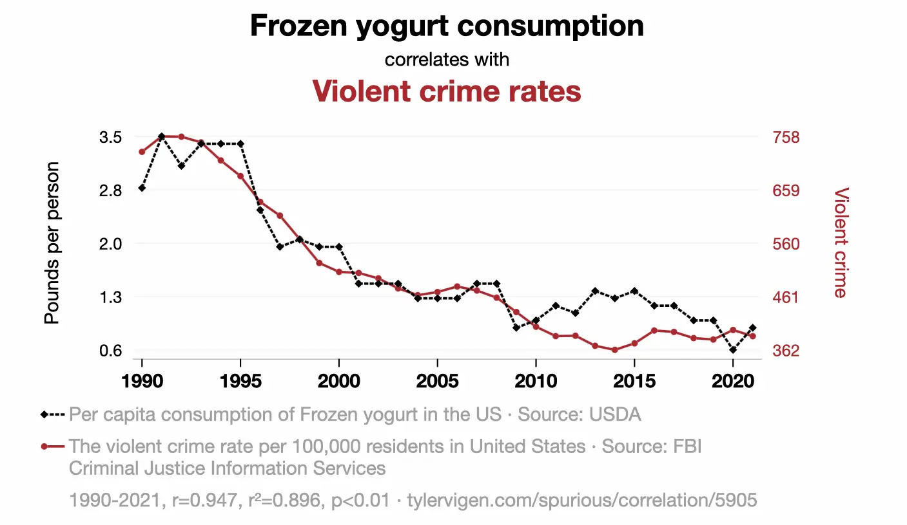{width=70%}
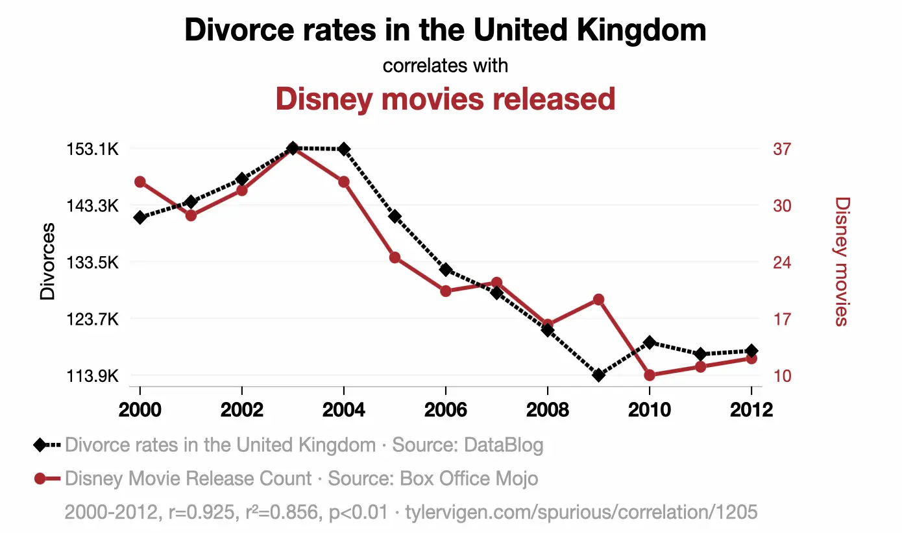{width=70%}

:::

::::

## 

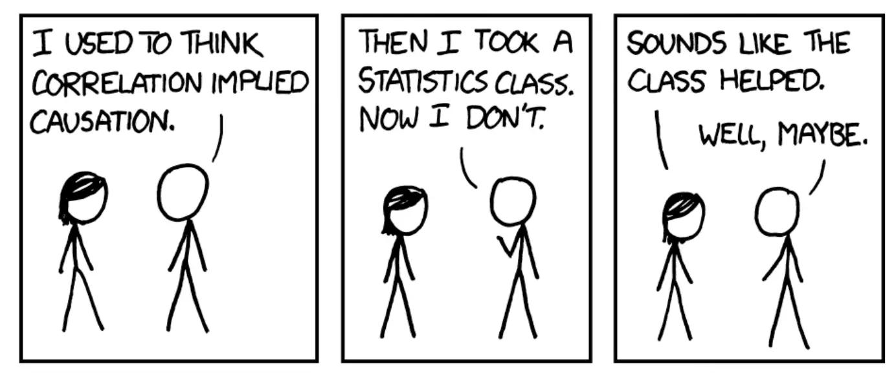{width=60%}


::: {.aside}
[https://xkcd.com/552/](https://xkcd.com/552/)
:::


## Outliers

- What is an outlier?
- Why do they arise?
- Can the linear fit be impacted by outliers and when?
- What can you say about the fit and residuals?

```{r}
#| echo: false

## add outlier points
set.seed(123)
nOutliers <- 30
advertisingOutlData <- rbind(advertisingData, 
                         data.frame(TV = runif(n = nOutliers, min = 50, max = 150), 
                                    radio = runif(n = nOutliers, min = 10, max = 15), 
                                    newspaper = runif(n = nOutliers, min = 10, max = 30), 
                                    sales = runif(n = nOutliers, min = 20, max = 30)))

## fit linear model with lm()
lmFit <- lm(sales ~ TV, data = advertisingOutlData) 

## prepare to plot
df <- do.call(cbind, list(advertisingOutlData, 
                          residual = lmFit$residuals, 
                          predictedSales = lmFit$fitted.values))
beta0lm <- lmFit$coefficients["(Intercept)"]
beta1lm <- lmFit$coefficients["TV"]

## plot
ggplot(df, aes(x = TV, y = sales)) + 
    geom_point() +
    geom_abline(intercept = beta0lm, slope = beta1lm, color = "firebrick") + 
    theme_bw() + 
    geom_segment(aes(x = TV, xend = TV, y = sales, yend = predictedSales),
                 color = "steelblue", alpha = 0.4)
```

## Robust regression

```{r}
#| echo: false

## robust linear fit
robustFit <- rlm(sales ~ TV, data = advertisingOutlData) 

## prepare to plot
df <- do.call(cbind, list(advertisingOutlData, 
                          predictedSales = robustFit$fitted.values, 
                          weightedResidual = robustFit$wresid, 
                          weight = robustFit$w))
beta0rlm <- robustFit$coefficients["(Intercept)"]
beta1rlm <- robustFit$coefficients["TV"]

## plot
p1 <- ggplot(df, aes(x = TV, y = sales)) + 
    geom_point() +
    geom_abline(intercept = beta0lm, slope = beta1lm, color = "firebrick") + 
    geom_abline(intercept = beta0rlm, slope = beta1rlm, color = "forestgreen") + 
    theme_bw() + 
    geom_segment(aes(x = TV, xend = TV, y = sales, yend = predictedSales),
                 color = "steelblue", alpha = 0.4)

p2 <- ggplot(df, aes(x = TV, y = sales)) + 
    geom_point(aes(color = weight)) +
    geom_abline(intercept = beta0rlm, 
                    slope = beta1rlm,
                    color = "forestgreen") +
    theme_bw() 

p1 + p2
```


## Data varies

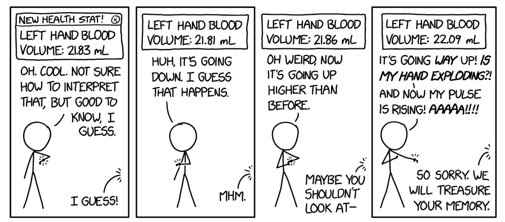{width=60%}

- We draw samples from a populationa and sample size matters.
- How strong is the signal. How easily is it detected and how much variance does it explain in the data?
- Something to be said for good quality data sets.


::: {.aside}
[https://xkcd.com/2581/](https://xkcd.com/2581/)
:::

## The bias-variance trade-off

- Suppose we have our estimated beta coefficients. Do you think we would get the same values if we did a fit on another set of observations? 
- What happens to beta coefficients predictors which are highly correlated but don't explain the response $y$?
- Out goal is get good and robust estimates of the coefficients that we can interpret.
- Shrinkage methods try to overcome these issues by imposing a penalty on the size of the coeficients.

::: {.fragment}
- variance: the amount by which $\hat{f}(x)$ would change if we estimate it in a different data set.
- bias: the error introduced by approximating a real life problem.
- trade-off: beta estimates will vary less at the expense of being slightly more biased.
:::

## Shrinkage methods: ridge

$$
\hat{\beta}=\min\limits_{\beta}\{\sum_{i=1}^N
(y_i - \beta_0 - \sum_{j=1}^px_{ij}\beta_j)^2 + \lambda \sum_{j=1}^p\beta_j^2 \}
$$

:::: {.columns}

::: {.column width="50%"}
::: {.fragment}
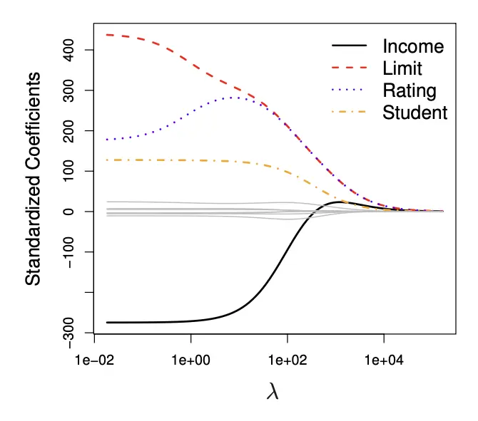{width=70%}
:::
:::

::: {.column width="50%"}
::: {.fragment}
- Where are we penalizing more harshly?
- What $\lambda$ would you choose?
:::
:::

::::

::: {.aside}
Image from An Introduction to Statistical Learning
:::

## k-fold cross validation

:::: {.columns}

::: {.column width="50%"}
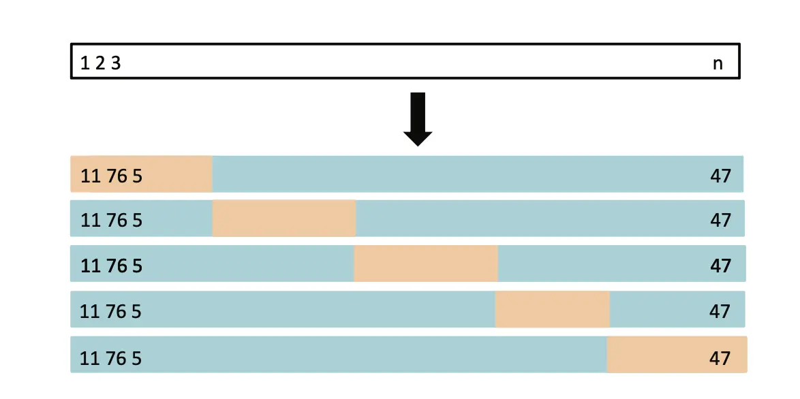

- For each $\lambda$, train on k-1 folds and test on kth fold.
- Compute prediction error and average the k prediction errors.
- Repeat for each $\lambda$.
:::

::: {.column width="50%"}
::: {.fragment}
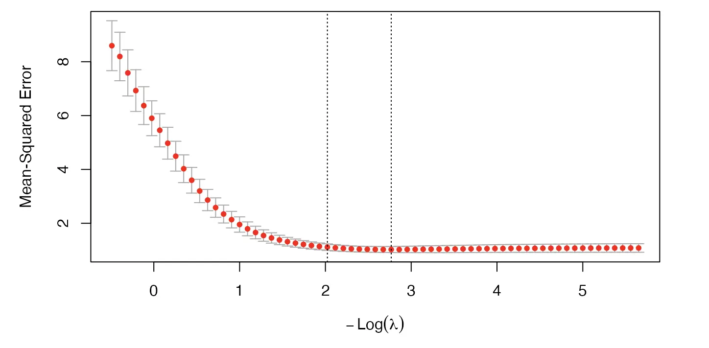
:::
:::

::::

::: {.aside}
Images from An Introduction to Statistical Learning and from `glmnet`
:::

## `glmnet`


:::: {.columns}

::: {.column width="50%"}
::: {.small}
```{r}
## prepare to fit
y <- Credit$Balance
X <- model.matrix(Balance ~ 0 + Income + Limit + Rating + 
                      Cards + Age + Education, 
                  data = Credit)

## fit
fit <- glmnet(x = X, y = y, alpha = 0)
fitCV <- cv.glmnet(x = X, y = y, alpha = 0)

## "best" lambda
fitCV$lambda.min
fitCV$lambda.1se
```
:::
:::

::: {.column width="50%"}
::: {.small}
```{r}
#| fig-height: 3

plot(fit)
plot(fitCV)
```
:::
:::

::::


## Shrinkage methods: lasso

$$
\hat{\beta}=\min\limits_{\beta}\{\frac{1}{2}\sum_{i=1}^N
(y_i - \beta_0 - \sum_{j=1}^px_{ij}\beta_j)^2 + \lambda \sum_{j=1}^p|\beta_j| \}
$$

- Variable *selection*.

|

:::: {.columns}

::: {.column width="50%"}
::: {.small}
```{r}
## fit
fitCV <- cv.glmnet(x = X, y = y, alpha = 1)

## "best" lambda
fitCV$lambda.min
fitCV$lambda.1se
```

```{r}
coef(fitCV, s = "lambda.1se")
```

:::
:::

::: {.column width="50%"}
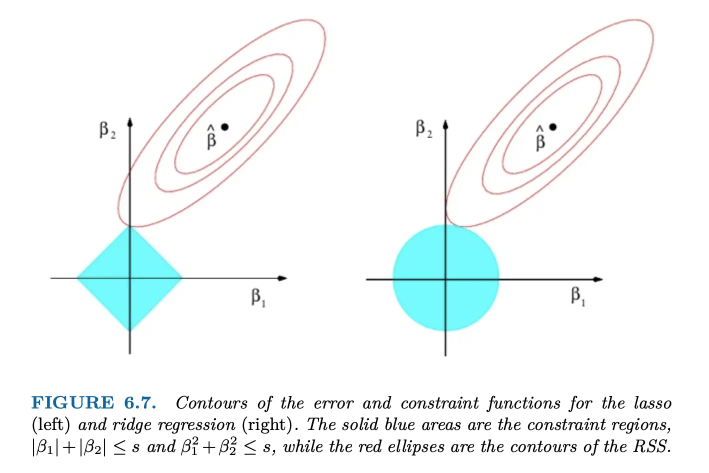
:::

::::

::: {.aside}
Image from An Introduction to Statistical Learning
:::

## Collinearity

- Suppose we have two variables that explain $y$ and which are highly correlated. What should and will the lasso do?
- Is this a problem?

```{r}
heatmap(cor(X))
```

## Shrinkage methods: elastic net

$$
\lambda \sum_{j=1}^p(\alpha|\beta_j| + (1-\alpha)\beta_j^2)
$$

- A compromise between the ridge and lasso. 
- $\alpha$ can be between 0 and 1. 
- Choice of $\alpha$ is not so easy and depends on how noisy the data is as well.

```{r}
fitCV <- cv.glmnet(x = X, y = y, alpha = 0.5)
```

## Stability selection

:::: {.columns}

::: {.column width="50%"}
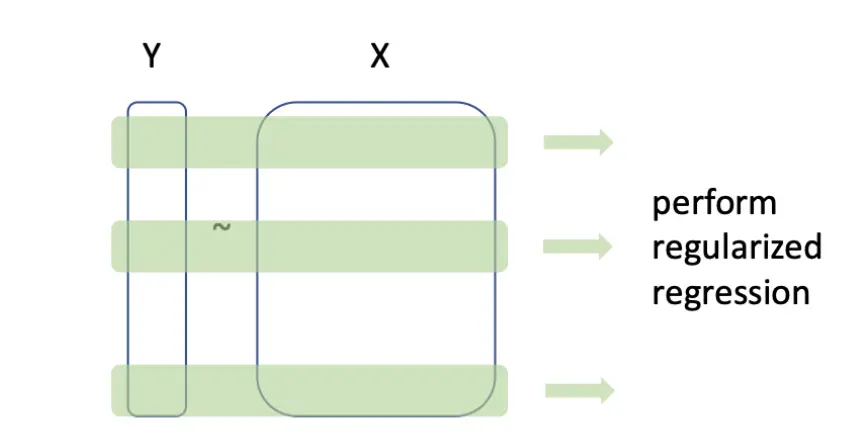{width=80%}

- Can be used when p > N.
- We speak of selection probability values for predictors instead of beta coefficient values.
- How is this calculated with lasso stability selection?

:::

::: {.column width="50%"}

::: {.fragment}
$$
\hat{\beta}=\min\limits_{\beta} (||y-X\beta||_2^2 + \lambda \sum_{j=1}^p\frac{|\beta_j|}{W_j} )
$$
:::

::: {.fragment}
- Randomized lasso stability selection.
- Weakness term is between 0 and 1.
- What do you think the effect of the weakness parameter is?
:::

::: {.fragment}
- The randomized lasso changes the penalty λ to a randomly chosen value in the range [λ, λ/weakness].
:::

:::

::::

## Stability paths

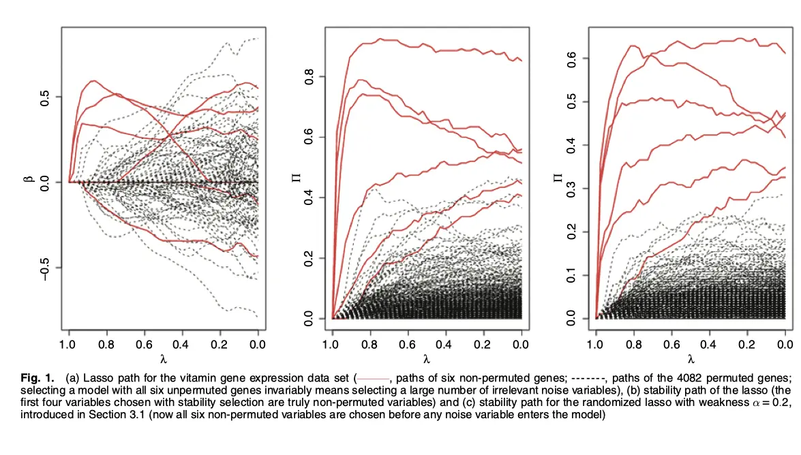{width=80%}

::: {.aside}
Meinshausen and Bühlmann 2010
:::

::: {.notes}
Q: comment on: lambda choice affecting beta coefficients, separation of signal from noise
:::


## Selecting true predictors

- Regularization with stability selection is very conservative in practice.
- We need to specify 2 of: probability cutoff, upper bound on PFER, number of selected variables q
- *Not* slecting a predictor is also a result and telling. Can you think of an example where this could happen?

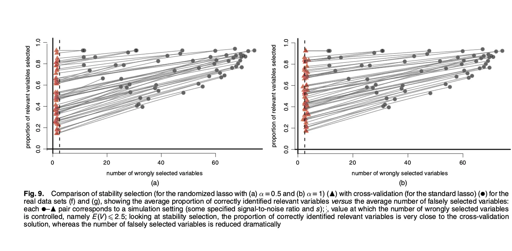{width=60%}

::: {.aside}
Meinshausen and Bühlmann 2010
:::

## Gaussian graphical models (GGMs)

- Model statistical relationships between variables using graphs
- Special algebraic and geometric properties
- Covariance matrix: covariance between each pair of variables
- In GGMs the inverse covariance matrix is the adjacency matrix (edges in graph)

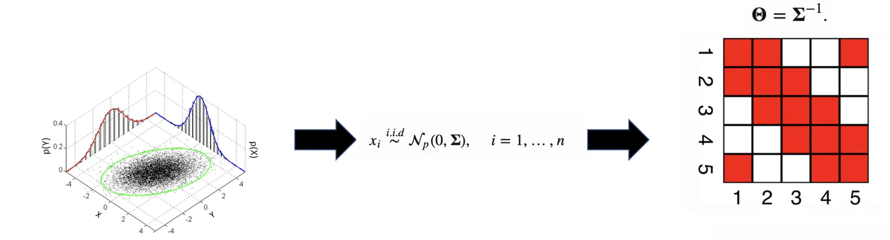{width=60%}

## Estimating the graph

:::: {.columns}

::: {.column width="50%"}

- Fitt lasso on each variable, using all others as predictors.
- Lambda controls sparsity.
- Draw edge with AND/OR rule.
- Edges in the graph reflect meaningful relationships. A missing edge between $x_1$ and $x_2$ means those two variables are conditionally independent given all other variables.

|

- Example: gene x cell count matrix. We want to learn the gene regulatory network. If necessary, we need to transform the data to look Gaussian to meet the needed assumptions. `glmnet` allows you to specify other distribution families that better match the response.

:::

::: {.column width="50%"}

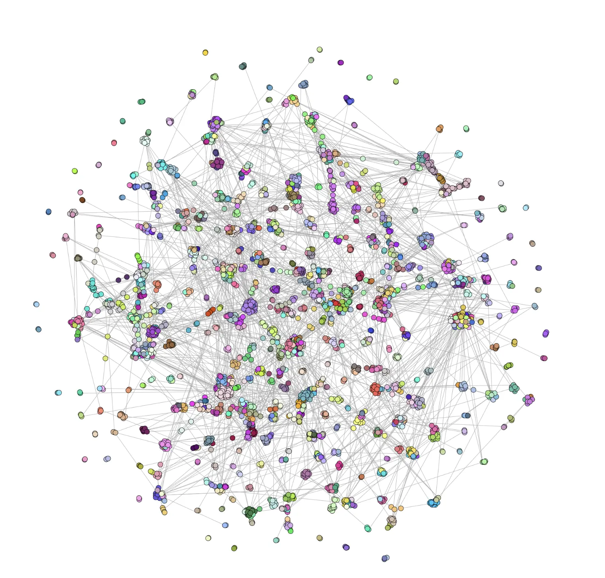

:::

::::

::: {.aside}
Meinshausen and Bühlmann 2006
:::

## And much more we haven't covered here

- Mixed effects models.
- Multivariate regression.
- Logistic regression.
- ... to mention a few additional ones.

## Experimental design


## Additional links

- Written by Witten (wxw): [https://www.danielawitten.com/written-by-witten](https://www.danielawitten.com/written-by-witten)
- Nicolei Meinshausen: [https://people.math.ethz.ch/~nicolai/](https://people.math.ethz.ch/~nicolai/)
- [https://www.tylervigen.com/spurious-correlations](https://www.tylervigen.com/spurious-correlations)
- [Journal of the Royal Statistical Society Series B](https://academic.oup.com/jrsssb)
- [Statistical Ideas that Changed the World](https://ledaliang.github.io/journalclub/)

. . .

- In reasoning quantitatively about the world and seeking to understand it, while thinking **critically** and **creatively**, maybe using some of the tools we learnt about today, **you** are a participating data scientist.


## Resources

:::: {.columns}

::: {.column width="50%"}

- **An Introduction to Statistical Learning with applications in R** -- Gareth James, Daniela Witten, Trevor Hastie and Robert Tibshirani

- [https://www.statlearning.com](https://www.statlearning.com)

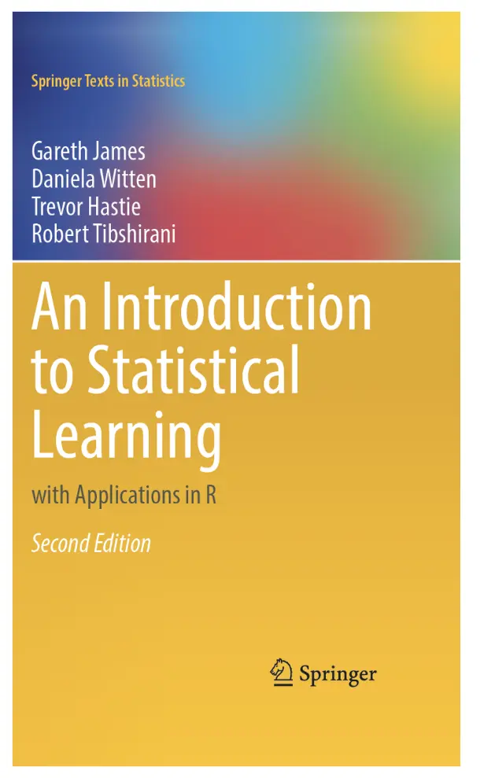{width=30%}

:::

::: {.column width="50%"}

- **The Elements of Statistical Learning** -- Trevor Hastie, Robert Tibshirani and Jerome Friedman

- [https://hastie.su.domains/ElemStatLearn](https://hastie.su.domains/ElemStatLearn/)

| 
| 

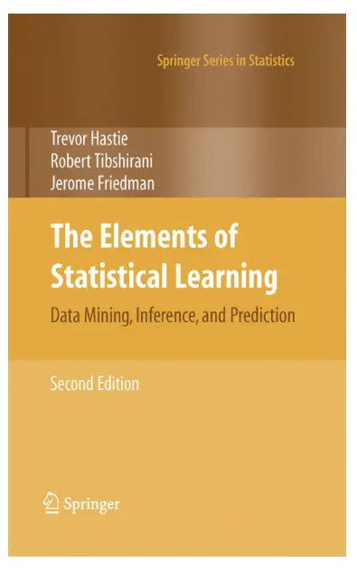{width=30%}

:::

::::


::: {.notes}
Freely available soft copies. Lots of online material, R packages with the datasets ISLR2.
::: 


## Concluding Remarks

::: {.v-center}
::: {}

"*The quiet statisticians have changed our world; not by discovering new facts or technical developments, but by changing the ways that we reason, experiment and form our opinions.*"

-- Ian Hacking 

| 
|
|

"*Many of us are drawn to the field of statistics because we are natural-born skeptics. Through our statistical training, we become more skeptical still. Our experience—both personal and professional—has taught us that if something seems too good to be true, then it probably is. We seek the simplest possible answer to every question, and no simpler. After all, statistics is hard. The key is to enjoy the challenge.*" 

-- Daniela Witten & Rob Tibshirani
:::
:::


## {background-image="/assets/images/network.svg"}

::: {.v-center .center}
::: {}

[Thank you!]{.largest}

[Questions?]{.larger}

[ • [SciLifeLab](https://www.scilifelab.se/) • [NBIS](https://nbis.se/) • [RaukR](https://nbisweden.github.io/raukr-2026)]{.smaller}

:::
:::


